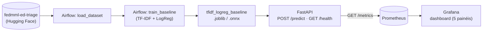
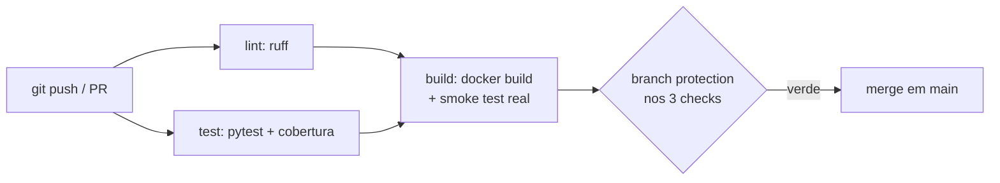

# Clinical Triage MLOps


[](https://github.com/VitorAkira-me/clinical-triage-mlops/actions/workflows/ci.yml)


Sistema de triagem automática de laudos médicos por urgência (normal / atenção / urgente),
desenvolvido pra o Tech Challenge - Fase 3 da Pós Tech em Machine Learning Engineering (FIAP).

> Projeto individual - continuação solo depois que o grupo original da Fase 1/2 se desfez.

## Autor

| Nome | RM | Contato |
|---|---|---|
| Vitor Akira Ucha Ito | RM371483 | [Github](https://github.com/VitorAkira-me) - [Linkedin](https://www.linkedin.com/in/vitor-akira/) |

🎥 Vídeo Explicativo em até 5 min: [ADICIONAR LINK]

## Fluxo do projeto





## Requisitos

- Docker + Docker Compose (build/run da API, da stack de monitoramento e da DAG do Airflow)
- Python 3.12+ e [uv](https://docs.astral.sh/uv/) - só se quiser rodar a API sem Docker
- `.env` na raiz com `HF_TOKEN` - só necessário pra baixar o dataset do zero (se
  `data/raw/fedmml_ed_triage_raw.parquet` já existir, nada disso é consultado; ver seção 3)

## 1. Visão geral

Comecei este projeto como laboratório pessoal de ML Engineering/MLOps, construído em público,
STEP por STEP, com cada decisão registrada num ADR - não é só a entrega da Fase 3.

**Problema**: hospitais recebem laudos em texto livre e precisam priorizar atendimento. Construí
um classificador de urgência a partir do texto do laudo.

**Objetivo**: uma API de inferência em produção, com pipeline de treino automatizado (Airflow),
CI/CD (GitHub Actions), observabilidade (Prometheus + Grafana) e uma técnica de otimização de
inferência com benchmark real de latência.

### 1.1 Dataset

[fedmml-ed-triage](https://huggingface.co/datasets/olaflaitinen/fedmml-ed-triage)
(Hugging Face) - **sintético**, licença CC BY 4.0. Uso só o campo de texto `clinical_notes`; o
alvo nativo ESI 1–5 foi remapeado por mim pra 3 classes (normal/atenção/urgente). Decisão
completa e trade-offs em [ADR-001](docs/decisions/ADR-001-dataset.md).

**Aviso importante**: o dataset é sintético e o mapeamento de urgência é uma adaptação de
engenharia deste projeto - não representa um padrão clínico oficial.

## 2. Decisão de arquitetura em nuvem

Fiz essa análise porque o Tech Challenge exige (`STEP 10` do [ROADMAP](docs/ROADMAP.md)), não
porque decidi implementar deploy de verdade - é raciocínio escrito, sem código, registrado em
[ADR-005](docs/decisions/ADR-005-cloud-strategy.md).

**Real-time, não batch, pra API.** Isso não é bem uma escolha nova, é uma constatação do que já
existe: desde a API-001 a API é síncrona - o cliente manda o texto, espera a resposta na mesma
requisição - e a latência importa o suficiente pra eu ter calibrado buckets de métrica na casa de
milissegundos (OBS-001) e medido a inferência isolada no benchmark ONNX (OPT-001). Processar em
lote mataria o próprio sentido de "triagem": o paciente já teria sido atendido, bem ou mal, antes
do lote rodar de madrugada. O treino é o oposto - já é batch por natureza (a DAG do Airflow roda
sob demanda, não fica ligada o tempo todo). Não planejei essa distinção de propósito, ela só
apareceu porque treino e inferência têm perfis de uso completamente diferentes.

**Provedor: recomendo AWS.** Não tenho compromisso com nenhum provedor hoje - é tudo Docker puro,
sem lock-in - então decidi pelo critério de menor distância entre o que já construí e o
equivalente gerenciado, não por "o que todo mundo usa". A AWS ganha nesse critério
especificamente: `ECS Fargate` roda o `Dockerfile` sem mudar uma linha, e `Amazon Managed
Prometheus` + `Amazon Managed Grafana` são literalmente os dois produtos que já escolhi rodando
local no `docker-compose.yml` da OBS-001 - migrar isso não é reescrever a stack de
observabilidade, é só apontar pra outro lugar. `MWAA` cobre o lado batch do treino sem eu
reescrever a DAG da AIR-001.

Isso não quer dizer que GCP estaria errado. `Cloud Run` é genuinamente mais simples de operar pra
uma API deste tamanho - serverless de verdade, escala a zero, `gcloud run deploy` direto do
Dockerfile. Se o critério fosse custo e simplicidade em vez de continuidade da stack que já
construí, eu escolheria diferente. Os dois caminhos, com os trade-offs completos, estão no
ADR-005.

## 3. Como executar

### 3.1 Demonstração com os modelos versionados

Versionei `models/tfidf_logreg_baseline.joblib` (9.044 bytes) e
`models/tfidf_logreg_baseline.onnx` (7.076 bytes). Para subir a demonstração, **não preciso
baixar o dataset, configurar `HF_TOKEN`, executar notebook ou rodar Airflow**. Os dados em
`data/raw/` e `data/processed/` continuam excluídos do Git; só os `.gitkeep` são rastreados.
A API usa o `.joblib`; o ONNX fica disponível para a comparação de inferência.

Validei em 14/09/2026, no Windows com PowerShell **7.6.5**, Docker Desktop **4.84.0** e
Engine **29.6.2**. Os comandos abaixo usam PowerShell 7 e `curl.exe` (evito o alias `curl`
do Windows PowerShell 5.1). Preciso do Docker em execução e das portas 8000, 9090 e 3000
livres; para a UI opcional do Airflow, também da 8080.

**Clone que executei na validação:** clonei o commit `7caf5eb` do repositório Git local
para uma pasta nova, usando `--no-local`, sem copiar nenhum arquivo manualmente. Esse
ensaio valida o conteúdo commitado; não valida a publicação desse commit no GitHub.
O repositório público é [VitorAkira-me/clinical-triage-mlops](https://github.com/VitorAkira-me/clinical-triage-mlops).
Os caminhos abaixo registram literalmente meu ensaio local.

Crio o clone separado; o Git respondeu `Cloning into ...clinical-triage-validacao-20260915...`.

```powershell
git clone --no-local C:\Users\vitor\Documents\clinical-triage-mlops C:\Users\vitor\Documents\clinical-triage-validacao-20260915
```

Na pasta do clone, subo os três serviços; obtive a imagem `Built`, a API `Healthy` e
Prometheus/Grafana `Started`.

```powershell
Set-Location C:\Users\vitor\Documents\clinical-triage-validacao-20260915
docker compose up -d --build
```

Confiro os serviços. Na minha execução apareceram estes nomes e portas:

```powershell
docker compose ps
```

| Container | Estado observado | Porta no host |
|---|---|---|
| `clinical-triage-validacao-20260915-api-1` | Up (healthy) | 8000 |
| `clinical-triage-validacao-20260915-prometheus-1` | Up | 9090 |
| `clinical-triage-validacao-20260915-grafana-1` | Up | 3000 |

O prefixo vem do nome da pasta do clone. Prometheus e Grafana não têm healthcheck Docker
configurado; confirmei a saúde deles pelos endpoints abaixo, além do estado `Up`.
O clone não tinha `.env`, e as pastas de dados continham somente `.gitkeep`. Confirmei
também que a API não recebeu token; a saída foi `HF_TOKEN presente: False`.

```powershell
docker compose exec -T api python -c "import os; print('HF_TOKEN presente:', 'HF_TOKEN' in os.environ)"
```

### 3.2 Testar a API

Consulto a saúde da API; recebi `{"status":"ok"}`.

```powershell
curl.exe -fsS http://localhost:8000/health
```

Envio uma nota de exemplo; recebi a classificação e probabilidades reproduzidas abaixo.

```powershell
curl.exe -fsS http://localhost:8000/predict -H 'Content-Type: application/json' -d '{"clinical_notes":"67yo M c/o chest pain, diaphoretic, in moderate distress"}'
```

```json
{"urgencia":"urgente","probabilidades":{"atencao":0.08943879110048149,"normal":0.17065262240079587,"urgente":0.7399085864987226}}
```

### 3.3 Confirmar a coleta do Prometheus

Consulto a prontidão; recebi `Prometheus Server is Ready.`.

```powershell
curl.exe -fsS http://localhost:9090/-/ready
```

Confiro o target e o último erro; recebi `health: up`, com `lastError` vazio.

```powershell
(curl.exe -fsS http://localhost:9090/api/v1/targets | ConvertFrom-Json).data.activeTargets | Select-Object scrapeUrl,health,lastError | ConvertTo-Json
```

```json
{
  "scrapeUrl": "http://api:8000/metrics",
  "health": "up",
  "lastError": ""
}
```

A UI fica em [localhost:9090/targets](http://localhost:9090/targets).
`api:8000` é o endereço interno do serviço na rede do Compose.

### 3.4 Acessar o Grafana e o dashboard provisionado

Consulto a saúde; recebi `database: ok`, versão `11.4.0`.

```powershell
curl.exe -fsS http://localhost:3000/api/health
```

Confirmo o dashboard com a credencial local `admin` / `admin`; obtive `provisioned: true`,
pasta `General`, título `Clinical Triage - Observabilidade (OBS-001)` e 5 painéis.

```powershell
$dashboard = curl.exe -fsS -u admin:admin http://localhost:3000/api/dashboards/uid/obs-001-clinical-triage | ConvertFrom-Json
$dashboard.meta | Select-Object provisioned,url,folderTitle | ConvertTo-Json
$dashboard.dashboard | Select-Object title,@{n='panels';e={$_.panels.Count}} | ConvertTo-Json
```

Abro [Grafana na porta 3000](http://localhost:3000), entro com `admin` / `admin` e acesso
[o dashboard provisionado](http://localhost:3000/d/obs-001-clinical-triage/clinical-triage-observabilidade-obs-001).
Confirmei esse caminho pela API do Grafana. As chamadas ao `/predict` geram métricas;
para os gráficos de taxa, preciso manter tráfego ao longo de mais de uma coleta.

### 3.5 Airflow: testar a DAG de retreino (opcional)

**Rodar a DAG só é necessário para quem quiser retreinar.** A demonstração acima já
funcionou antes desta etapa. O script executa `airflow dags test`, termina e remove seu
container; ele **não sobe uma UI**. O teste efetivamente regrava o `.joblib`.

Executei esta etapa no workspace original, que já tinha
`data/raw/fedmml_ed_triage_raw.parquet`. Confirmei no log que ele foi reutilizado, sem
novo download. Em um ambiente sem dados nem cache, a DAG precisa de acesso ao dataset
gated e de `HF_TOKEN` no `.env`; não testei esse caminho de download nesta sessão.

Na raiz do workspace, executo o script existente; as tasks `load_dataset` e
`train_baseline` ficaram `SUCCESS`, a DagRun ficou `state=success` e o script terminou
com `Tudo certo.` e exit code 0.

```powershell
Set-Location C:\Users\vitor\Documents\clinical-triage-mlops
.\scripts\run_airflow_dag.ps1
```

O script usou a data `2026-09-14` e confirmou o modelo atualizado com 9.044 bytes às
21:42:55. A data é calculada pelo próprio script. A checagem de atualização evita aceitar
uma DagRun que reporte sucesso sem executar as tasks.

### 3.6 Airflow: subir a UI para visualização (opcional)

Executo o script separado e mantenho esse terminal aberto; ele anunciou
`Subindo Airflow standalone em http://localhost:8080`. É modo de demonstração.

```powershell
.\scripts\run_airflow_ui.ps1
```

Em outro terminal, verifico saúde e login. Recebi `healthy` para `metadatabase`,
`scheduler` e `triggerer`, e HTTP `200` para o login. O campo `dag_processor` veio com
status `null` nessa configuração standalone.

```powershell
curl.exe -fsS http://localhost:8080/health
curl.exe -s -o NUL -w '%{http_code}' http://localhost:8080/login/
```

Leio a senha gerada do usuário `admin`; confirmei que este arquivo existe dentro do
container `air001-ui-standalone`. A senha muda entre containers, por isso leio a atual.

```powershell
docker exec air001-ui-standalone cat /opt/airflow/standalone_admin_password.txt
```

Confiro a DAG; apareceu `air001_train_baseline`, owner `airflow`, `is_paused: True`.

```powershell
docker exec air001-ui-standalone airflow dags list
```

Abro [Airflow na porta 8080](http://localhost:8080), entro com `admin` e a senha do
arquivo. A DAG já está disponível para visualização. Se quiser retreinar pela UI, ativo
a DAG e disparo uma execução pelo botão de play; isso também sobrescreve o modelo.

### 3.7 Executar o benchmark ONNX vs. sklearn (opcional)

O script real é `benchmarks/opt001_onnx_benchmark.py`. Ele lê o `.joblib` e o parquet
local, converte o pipeline para ONNX, verifica corretude e mede latência. **O benchmark
precisa do dataset local**, mesmo com os pesos versionados; não é pré-requisito da API.

No workspace original, instalo os extras do lockfile. Minha primeira tentativa direta
falhou com `ModuleNotFoundError: No module named 'onnxruntime'`; este comando instalou
os extras, incluindo `onnxruntime==1.23.2` e `skl2onnx==1.20.0`, sem alterar o lockfile.

```powershell
uv sync --frozen --extra benchmark --extra data
```

Executo o benchmark com os mesmos extras ativos; terminou com exit code 0 e
`Resultados salvos em docs\experiments\OPT-001-benchmark.json`.

```powershell
uv run --frozen --extra benchmark --extra data python benchmarks/opt001_onnx_benchmark.py
```

Na execução final desta sessão, sobre o `.joblib` original do commit `7caf5eb`, obtive:

| Medida | sklearn | ONNX |
|---|---:|---:|
| Mediana (300 iterações) | 0,4046 ms | 0,0358 ms |
| p95 | 0,4779 ms | 0,0473 ms |

Corretude: **150/150 classes iguais**, diferença máxima de probabilidade `8,11e-08`.
Speedup: **11,30x na mediana** e **10,10x no p95**. Mantive o
[JSON gerado pelo script](docs/experiments/OPT-001-benchmark.json), sem edição manual.

O script regrava o `.onnx` e o JSON. Após validar os scripts, restaurei os dois modelos
originais versionados na Tarefa 1; assim, a entrega preserva exatamente os artefatos
que usei no clone limpo. Os tempos acima medem inferência isolada e variam por execução.

### 3.8 CI/CD

`.github/workflows/ci.yml` executa lint, testes e build. As decisões existentes estão em
[CI-001](docs/specs/CI-001-ci-pipeline.md). Nesta alteração validei os comandos de
execução acima; não alterei aplicação, testes nem configuração de CI.

## 4. Resultados

### 4.1 Modelo

Baseline: TF-IDF + Logistic Regression (`class_weight="balanced"`), treinado sobre
`clinical_notes`. Split treino/teste estratificado (80/20, `random_state=42`). Ver
[notebooks/02_baseline.ipynb](notebooks/02_baseline.ipynb) e métricas completas em
[docs/experiments/ML-003-baseline-metrics.json](docs/experiments/ML-003-baseline-metrics.json).

#### 4.1.1 Limitações do dataset - vazamento de rótulo

Durante a EDA (ML-002) e confirmado empiricamente na ML-003, achei que o campo `clinical_notes`
do `fedmml-ed-triage` é gerado por um template fixo: as 28 categorias de `chief_complaint` e as 5
variantes de cláusula final do texto mapeiam pra classe de urgência com 100% de precisão, sem
exceção, nas 85.679 notas verificadas.

Pra confirmar isso, comparei o baseline de texto (TF-IDF + Logistic Regression) lado a lado com
um baseline ingênuo que classifica só pelo `chief_complaint` (dicionário complaint → classe
majoritária):

| Modelo | F1 macro | Recall macro | Recall (`urgente`) |
|---|---|---|---|
| TF-IDF + Logistic Regression | 1.00 | 1.00 | 1.00 |
| Ingênuo (só `chief_complaint`) | 1.00 | 1.00 | 1.00 |

*(17.136 exemplos de teste; matrizes de confusão idênticas, diagonais perfeitas - ver
[métricas completas](docs/experiments/ML-003-baseline-metrics.json))*

Os dois empatam exatamente. O classificador de texto não demonstra nenhuma capacidade real de
NLP clínico - ele decorou uma tabela de busca embutida no template do gerador sintético, não
aprendeu linguagem clínica. Validei que esse vazamento é específico do texto: os campos de
vitais/labs (fora do escopo do classificador), como `spo2`, `heart_rate` e troponina, seguem
distribuições com sobreposição real entre classes, sem determinismo perfeito.

Decidi manter o dataset e reportar isso com transparência, em vez de trocar de fonte ou esconder
o resultado - decisão completa e alternativas descartadas em
[ADR-002](docs/decisions/ADR-002-text-leakage.md). As métricas de ~100% deste projeto não devem
ser lidas como "o modelo é excelente" - são evidência de um artefato de geração de dados
sintéticos. Reconfirmei isso duas vezes de forma independente, sem planejar: com dados baixados
de novo do zero na AIR-001, e com 150 chamadas reais ao `/predict` na OBS-001. Mesmo padrão, 100%
das vezes.

### 4.2 Otimização (ONNX) e benchmark

Converti o baseline pra ONNX via `skl2onnx` - o **pipeline inteiro**, não só o classificador.
Funcionou de primeira: o `TfidfVectorizer` foi treinado com hiperparâmetros default, o caso mais
simples de converter, então nem cheguei a precisar do fallback (classificador isolado, TF-IDF em
sklearn) que deixei implementado pra esse cenário.

Validei corretude **antes** de medir qualquer velocidade - não adianta ser mais rápido se estiver
errado: 150 textos reais do dataset, 150/150 classes batendo entre sklearn e ONNX, diferença
máxima de probabilidade de `8.11e-08` (tolerância usada: `1e-4`).

Latência (300 iterações, mesma entrada, mesma máquina, depois de warmup):

| | sklearn original | ONNX (onnxruntime) | Speedup |
|---|---|---|---|
| Mediana | 0.4046 ms | 0.0358 ms | **11,30x** |
| p95 | 0.4779 ms | 0.0473 ms | **10,10x** |

Tamanho do artefato: 9.044 bytes (`.joblib`) contra 7.076 bytes (`.onnx`), -22%.

Uma ressalva que preciso deixar clara: esses 0.4ms do sklearn já são extremamente baixos em
termos absolutos - a latência ponta-a-ponta da API real (HTTP + serialização, medida na OBS-001)
fica na casa de 6-9ms, dominada por overhead de rede, não pela inferência. O ganho de ~11x é real
na camada de inferência isolada; não medi (não era o objetivo deste card) o quanto isso se
traduziria em latência percebida pelo cliente se a API passasse a servir via ONNX - troca que não
fiz em produção, isto aqui é comparação/benchmark. Script reprodutível e a trajetória completa da
conversão em [docs/specs/OPT-001.md](docs/specs/OPT-001.md) e
[docs/experiments/OPT-001-benchmark.json](docs/experiments/OPT-001-benchmark.json).

## 5. Monitoramento

Prometheus + Grafana sobem junto com a API via `docker compose up -d --build` (seção 3.1), dashboard
provisionado por arquivo. Os 5 painéis, todos validados com dado real - não só a métrica
existindo, o número batendo com o tráfego que gerei:

1. **Taxa de requisições** (por rota), a partir de `http_requests_total` (RED, OBS-001 Passo 1).
2. **Latência p95** (por rota), `histogram_quantile` sobre `http_request_duration_seconds_bucket`
   - os buckets padrão da lib são pensados pra web genérica e dariam zero resolução aqui, então
   calibrei pra latência sub-segundo.
3. **Distribuição de classes previstas ao longo do tempo**, `rate(triage_predictions_total)` por
   classe - proxy de drift: sem rótulo verdadeiro disponível em produção, uma mudança anormal na
   proporção normal/atenção/urgente é o sinal indireto que tenho.
4. **Confiança por classe** (p50 e p95, linhas simples), sobre
   `triage_prediction_confidence_bucket` - buckets recalibrados na prática depois que a hipótese
   inicial se mostrou conservadora demais (detalhes na seção 6).
5. **Taxa de erro**, `http_requests_total` filtrando status diferente de `2xx`. "No data" é o
   estado normal enquanto não houver erro real na janela do painel - confirmei gerando um erro de
   propósito e vendo o painel reagir na hora, não é bug nem configuração errada.

Os painéis 3 e 4 não são detecção estatística formal de drift - são gatilho pra eu (ou quem
estiver de plantão) ir investigar, não um alarme automático. Decisões completas em
[docs/specs/OBS-001.md](docs/specs/OBS-001.md).

## 6. Limitações e lições aprendidas

O achado mais importante do projeto inteiro é o vazamento de rótulo (seção 4.1.1): as métricas de
~100% não provam capacidade de NLP clínico, provam que o modelo decorou um template. É a lição de
MLOps que mais levo daqui - validar o dado antes de comemorar a métrica, e reportar isso com
transparência em vez de esconder.

Descobri outra coisa só rodando tráfego de verdade contra o dashboard: métrica bem desenhada não
é o mesmo que visualização útil. Os buckets de confiança que calibrei no Passo 2 da OBS-001 tinham
o label certo, o teste unitário passava - e mesmo assim `histogram_quantile` devolvia `NaN`
contra o modelo real, porque a distribuição real caía numa faixa de 0,005 de largura que os
buckets simplesmente não resolviam. Só apareceu quando gerei 90 chamadas reais e olhei o número,
não no design isolado da métrica.

Relacionado: `rate()`/`histogram_quantile()` precisam de tráfego espalhado no tempo, não uma
rajada. Uma rajada instantânea prova que a métrica está correta e ainda assim produz `rate() ==
0` (ou resultado vazio) num painel - o Prometheus não viu a transição, só o valor final parado.
Peguei isso duas vezes, sem querer: uma na validação do Passo 5 da OBS-001, outra de novo
validando o painel de erro pra este README.

Drift de ambiente entre quem treina e quem serve é risco real, não teórico. O container do
Airflow instalou uma versão de `scikit-learn` diferente da API porque eu não tinha fixado versão
no `requirements.txt` - o `.joblib` carregou mesmo assim (só um warning), mas podia não ter
carregado. O mesmo aconteceu com `pyarrow`: sem versão fixa, quebrou a leitura de um parquet
escrito por outra versão (`OSError: Repetition level histogram size mismatch`). Fixar versão
exata nos dois lados deixou de ser opcional antes de eu converter pra ONNX.

O Airflow nativo não roda no Windows - não assumi isso, testei: o próprio `import airflow`
imprime um aviso da lib avisando, e uma importação básica (`DagBag`) já quebra. Rodar em Docker
desde o início evitou eu ter que voltar atrás nessa decisão depois.

E a lição mais recente, literalmente da véspera do vídeo: documentação errada quebra ambiente de
verdade, não é só "falta de polimento". As instruções do Airflow que eu tinha escrito eram só
bash e diziam explicitamente que funcionariam em PowerShell - não funcionavam, quebravam por
completo. Pior: ao tentar simplificar o comando pra fugir desse bug de shell usando uma data fixa
arbitrária, criei um segundo bug, mais grave - o Airflow marca a run como sucesso, com exit code
0, sem rodar nenhuma task, se a data passada for anterior ao `start_date` da DAG. Silencioso, sem
erro nenhum. Só peguei porque o script de validação que escrevi checa se o arquivo do modelo foi
de fato atualizado, não só se a DAG "reportou sucesso".

## 7. Decisões arquiteturais

Ver [docs/decisions/](docs/decisions/) - ADR-001 (dataset), ADR-002 (vazamento de rótulo),
ADR-005 (estratégia de cloud, seção 2).

## 8. Estrutura do projeto

```
clinical-triage-mlops/
├── .github/workflows/          # CI (lint, test, build) - CI-001
├── airflow/
│   ├── dags/                   # DAG de treino - AIR-001
│   └── Dockerfile
├── benchmarks/                 # conversão ONNX + benchmark - OPT-001
├── data/{raw,processed}/
├── docs/{decisions,specs,experiments}/
├── monitoring/{prometheus,grafana}/  # scrape config + dashboard provisionado - OBS-001
├── notebooks/
├── scripts/                    # run_airflow_dag.sh/.ps1 - AIR-001
├── src/api/                    # FastAPI - API-001
├── tests/
├── models/                     # .joblib/.onnx treinados e versionados
├── .claude/CLAUDE.md
├── Dockerfile                  # DOCK-001
├── docker-compose.yml          # OBS-001
└── pyproject.toml
```

## 9. Roadmap

Ver [docs/ROADMAP.md](docs/ROADMAP.md) - concluído até o `STEP 11`; falta só o vídeo (`STEP 12`).
